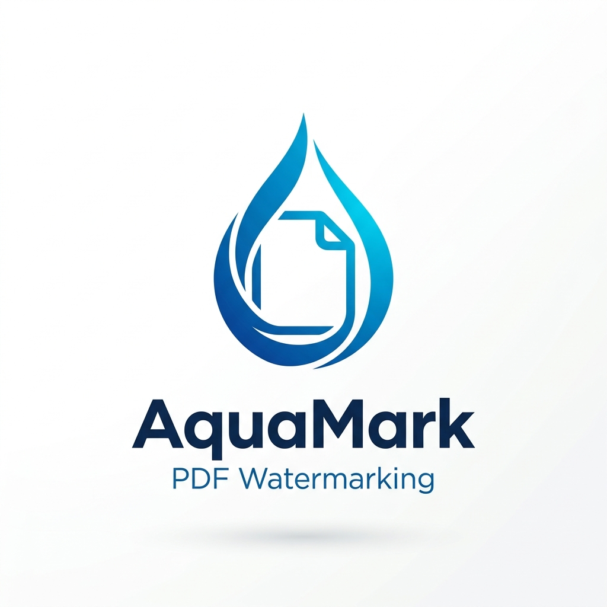

<a id="readme-top"></a>

<!-- ESCUDOS DO PROJETO -->
[![Contributors][contributors-shield]][contributors-url]
[![Forks][forks-shield]][forks-url]
[![Stargazers][stars-shield]][stars-url]
[![Issues][issues-shield]][issues-url]
[![MIT License][license-shield]][license-url]
[![LinkedIn][linkedin-shield]][linkedin-url]

<!-- LOGOTIPO DO PROJETO -->
<br />
<div align="center">
  <a href="https://github.com/alissonpef/Flask-PDF-Watermarker">
    
  </a>

  <h3 align="center">AquaMark 💧</h3>

  <p align="center">
    Uma aplicação web robusta em Flask para adicionar marcas d'água personalizadas (texto ou imagem) aos seus arquivos PDF, protegendo seus documentos de forma simples e eficiente.
    <br />
    <br />
    <a href="https://github.com/alissonpef/Flask-PDF-Watermarker/issues/new?labels=bug&template=bug-report---.md">Reportar Bug</a>
    &middot;
    <a href="https://github.com/alissonpef/Flask-PDF-Watermarker/issues/new?labels=enhancement&template=feature-request---.md">Solicitar Recurso</a>
  </p>
</div>

<!-- ÍNDICE -->
<details>
  <summary>Índice</summary>
  <ol>
    <li>
      <a href="#sobre-o-projeto">Sobre O Projeto</a>
      <ul>
        <li><a href="#construído-com">Construído Com</a></li>
      </ul>
    </li>
    <li>
      <a href="#começando">Começando</a>
      <ul>
        <li><a href="#pré-requisitos">Pré-requisitos</a></li>
        <li><a href="#instalação">Instalação</a></li>
      </ul>
    </li>
    <li><a href="#uso">Uso</a></li>
    <li><a href="#contribuindo">Contribuindo</a></li>
    <li><a href="#licença">Licença</a></li>
    <li><a href="#contato">Contato</a></li>
  </ol>
</details>

<!-- SOBRE O PROJETO -->
## Sobre O Projeto

Este projeto resolve o problema de proteção de documentos, permitindo que usuários insiram identificações visuais (como logotipo ou texto de confidencialidade) antes de compartilhá-los. O funcionamento principal ocorre através do upload de um PDF pelo usuário, que pode escolher entre uma marca d'água de texto (customizando cor, fonte e tamanho) ou de imagem (fazendo o upload do arquivo). O sistema processa o arquivo no servidor, sobrepondo a marca d'água na opacidade e posição definidas, e retorna automaticamente o PDF final para download. O processamento é seguro, realizado em memória sem salvar os arquivos temporários no disco do servidor.

Principais características:
* **Tipos de Marca d'Água:** Texto customizado ou imagem.
* **Controle de Estilo Total:** Personalize opacidade, cor e tamanho da fonte.
* **Processamento Seguro em Memória:** Uploads e edições feitas diretamente na memória.
* **Interface Dinâmica:** O formulário se adapta com base no tipo escolhido.

[![Screen Shot][product-screenshot]](assets/image.png)

<p align="right">(<a href="#readme-top">voltar ao topo</a>)</p>

### Construído Com

* [![Python][Python]][Python-url]
* [![Flask][Flask]][Flask-url]
* [![HTML5][HTML5]][HTML5-url]
* [![CSS3][CSS3]][CSS3-url]
* [![PyPDF2][PyPDF2]][PyPDF2-url]
* [![Ruff][Ruff]][Ruff-url]

<p align="right">(<a href="#readme-top">voltar ao topo</a>)</p>

<!-- COMEÇANDO -->
## Começando

Para executar uma cópia local funcionando, siga os passos abaixo. O gerenciamento de dependências é feito com a ferramenta `uv`.

### Pré-requisitos

* uv
  ```sh
  curl -LsSf https://astral.sh/uv/install.sh | sh
  ```

### Instalação

1. Clone o repositório
   ```sh
   git clone https://github.com/alissonpef/Flask-PDF-Watermarker.git
   cd Flask-PDF-Watermarker
   ```
2. Sincronize as dependências e crie o ambiente virtual automaticamente
   ```sh
   uv sync
   ```
3. Crie as variáveis de ambiente baseadas no exemplo (se necessário)
   ```sh
   cp .env.example .env
   ```
4. Inicie o servidor de desenvolvimento
   ```sh
   uv run flask run
   ```

<p align="right">(<a href="#readme-top">voltar ao topo</a>)</p>

<!-- EXEMPLOS DE USO -->
## Uso

Acesse a aplicação em `http://127.0.0.1:5000` em seu navegador. Envie um arquivo PDF, escolha se deseja colocar uma marca d'água de texto ou imagem, ajuste a opacidade e posicione como preferir, depois clique em enviar para receber seu documento protegido.

Para rodar a verificação de linter e formatação com o Ruff:
```sh
uv run ruff format .
uv run ruff check .
```

<p align="right">(<a href="#readme-top">voltar ao topo</a>)</p>

<!-- CONTRIBUINDO -->
## Contribuindo

As contribuições são o que tornam a comunidade open source um lugar tão incrível para aprender, inspirar e criar. Qualquer contribuição que você fizer será **muito apreciada**.

1. Faça o Fork do Projeto
2. Crie a sua Branch de Funcionalidade (`git checkout -b feature/FuncionalidadeIncrivel`)
3. Commit suas Mudanças (`git commit -m 'Adicione alguma FuncionalidadeIncrivel'`)
4. Faça o Push para a Branch (`git push origin feature/FuncionalidadeIncrivel`)
5. Abra um Pull Request

### Principais contribuidores:

<a href="https://github.com/alissonpef/Flask-PDF-Watermarker/graphs/contributors">
  
</a>

<p align="right">(<a href="#readme-top">voltar ao topo</a>)</p>

<!-- LICENÇA -->
## Licença

Distribuído sob a Licença MIT. Veja `LICENSE` para mais informações.

<p align="right">(<a href="#readme-top">voltar ao topo</a>)</p>

<!-- CONTATO -->
## Contato

Alisson Pereira Ferreira - alissonpef@gmail.com - [LinkedIn](https://www.linkedin.com/in/alisson-pereira-ferreira/)

Link do Projeto: [https://github.com/alissonpef/Flask-PDF-Watermarker](https://github.com/alissonpef/Flask-PDF-Watermarker)

<p align="right">(<a href="#readme-top">voltar ao topo</a>)</p>

---

Made with ❤️ by **Alisson Pereira**.

<!-- MARKDOWN LINKS & IMAGES -->
[contributors-shield]: https://img.shields.io/github/contributors/alissonpef/Flask-PDF-Watermarker.svg?style=for-the-badge
[contributors-url]: https://github.com/alissonpef/Flask-PDF-Watermarker/graphs/contributors
[forks-shield]: https://img.shields.io/github/forks/alissonpef/Flask-PDF-Watermarker.svg?style=for-the-badge
[forks-url]: https://github.com/alissonpef/Flask-PDF-Watermarker/network/members
[stars-shield]: https://img.shields.io/github/stars/alissonpef/Flask-PDF-Watermarker.svg?style=for-the-badge
[stars-url]: https://github.com/alissonpef/Flask-PDF-Watermarker/stargazers
[issues-shield]: https://img.shields.io/github/issues/alissonpef/Flask-PDF-Watermarker.svg?style=for-the-badge
[issues-url]: https://github.com/alissonpef/Flask-PDF-Watermarker/issues
[license-shield]: https://img.shields.io/github/license/alissonpef/Flask-PDF-Watermarker.svg?style=for-the-badge
[license-url]: https://github.com/alissonpef/Flask-PDF-Watermarker/blob/main/LICENSE
[linkedin-shield]: https://img.shields.io/badge/-LinkedIn-black.svg?style=for-the-badge&logo=linkedin&colorB=555
[linkedin-url]: https://www.linkedin.com/in/alisson-pereira-ferreira/
[Python]: https://img.shields.io/badge/Python-3776AB?style=for-the-badge&logo=python&logoColor=white
[Python-url]: https://www.python.org/
[Flask]: https://img.shields.io/badge/Flask-000000?style=for-the-badge&logo=flask&logoColor=white
[Flask-url]: https://flask.palletsprojects.com/
[HTML5]: https://img.shields.io/badge/HTML5-E34F26?style=for-the-badge&logo=html5&logoColor=white
[HTML5-url]: https://developer.mozilla.org/en-US/docs/Web/HTML
[CSS3]: https://img.shields.io/badge/CSS3-1572B6?style=for-the-badge&logo=css3&logoColor=white
[CSS3-url]: https://developer.mozilla.org/en-US/docs/Web/CSS
[JavaScript]: https://img.shields.io/badge/JavaScript-F7DF1E?style=for-the-badge&logo=javascript&logoColor=black
[JavaScript-url]: https://developer.mozilla.org/en-US/docs/Web/JavaScript
[PyPDF2]: https://img.shields.io/badge/PyPDF2-FF4B4B?style=for-the-badge
[PyPDF2-url]: https://pypdf2.readthedocs.io/
[Ruff]: https://img.shields.io/badge/Ruff-E5A01D?style=for-the-badge
[Ruff-url]: https://docs.astral.sh/ruff/
[product-screenshot]: assets/image.png

